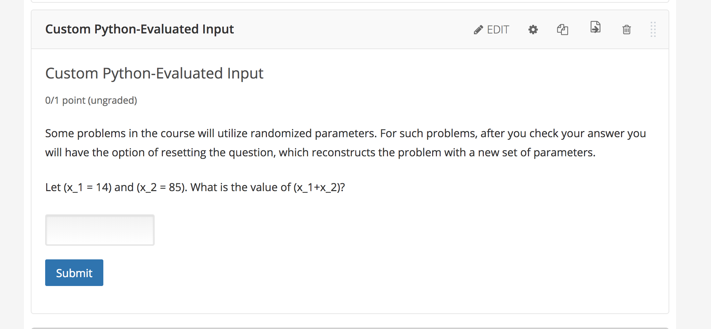

# blocks4edx
blocks4edx可用于替代Open edX的`Custom Python-Evaluated Input`题目编辑器。允许课程团队在不写代码的情况下，通过拖拽积木自动生成代码与题目(XML).

# usage
访问: [blocks4edx](https://e-ducation.github.io/blocks4edx)

### 选择题型
首先选择你希望创建的Python-Evaluated Input题型， 目前支持多选题(单选题和多选题是一种题型)和填空题，之后会陆续添加其他题型。

当你选择完题型后，blocks4edx将自动为你创建题目模版。如果你已经熟悉blocks4edx，你也可以从空模版开始自行拼搭。

### 拼搭积木
选择你需要的积木块，构建出你的题目

### 复制题目
完成之后，点击`复制题目`， 之后打开open edx课程编辑页面，选择`Custom Python-Evaluated Input`控件，ctrl-v黏贴即可。

多选题的模版来自elite的课程实际题目。

填空题的模版来自[open edx官方文档](https://edx.readthedocs.io/projects/edx-partner-course-staff/en/latest/exercises_tools/custom_python.html#create-a-randomized-custom-python-evaluated-input-problem)

### 导入导出
你可以将制作的题目导出保存，用作之后的模版(导入即可)，或者分享给同事，让课程团队可以在已完成的题目上快速展开新的工作。

# todo
blocks4edx不只适用于`Custom Python-Evaluated Input`题目，也适用于edx的其他题目，我们将在之后继续探索。

blocks4edx的目标是为课程团队提供更好的题目编辑器。

# 参考
[Write-Your-Own-Grader Problem](https://edx.readthedocs.io/projects/edx-partner-course-staff/en/latest/exercises_tools/custom_python.html#write-your-own-grader-problem)